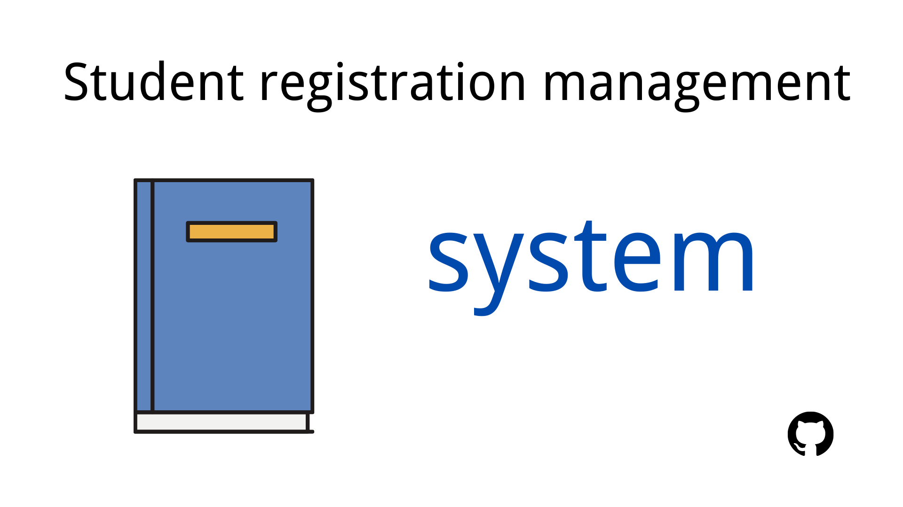

# 学生学籍管理系统
[](https://github.com/KaiLongWu/sql)


## 1.简介
 改变传统txt数据储存方式，使用mysql关系数据库作为储存介质，增强安全性。操作方面，通过mysql api来直接调用数据库信息，兼简单便捷为一体。


## 2.依赖项

`Mysql 8.0`<br>
`visual studio 2019`


## 3.程序结构
```mermaid
graph TD
A[start] --> B(数据库连接)
B-->M(学生学籍管理系统)
    M --> D[学生信息查询]
    M --> E[学生信息增添]
    M --> H[学生信息修改]   
    M --> g[学生信息删除]   
    F[学生学籍管理系统]
```

## 4.MYSQL API使用
1. 在visual studio 2019中设置，工程--属性--VC++目录--包含目录，将`mysql server\include`的绝对路径添加进去，例如`C:\Program Files\MySQL\MySQL Server 8.0\include`。将mysql server\lib文件夹下的`libmysql.lib`和`libmysql.dll`拷贝到工程目录下。
2. 在Mysql 8.0中建立新数据库`student`,创建表`persons`。表如下图。
   
stu_id | stu_name | stu_gender | stu_class
---|:---:|:---:|:---:
u201911910|张三|男|3
u201911918|小红|女|2
3. 为工程添加附加依赖项`wsock32.lib`和`libmysql.lib`，一种方式是工程--属性--链接器--输入--附加依赖项，另一种是在程序开头用```#pragma comment(lib,"xxx.lib")```

4. 为程序添加头文件`"mysql.h"`和`WinSock.h`
5. 使用Mysql sever提供的库函数。

## 5.测试
测试机需安装`mysql`，`visual studio 2019`
修改mysql 地址、用户和密码，使用visual studio 2019 编译```sql/sql.cpp```
